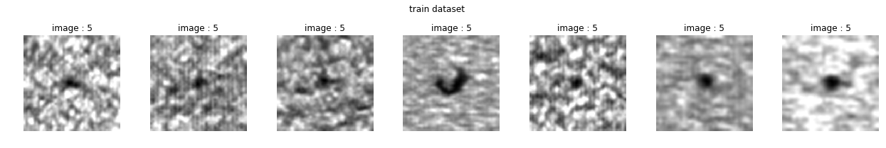
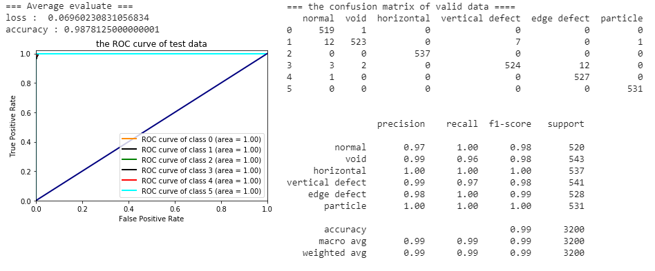

# **【廣達電腦徵才】自動光學檢測領域** #

----------
## Author ##
*Yuan Jui Huang (黃元瑞)* 

## **Data Description (the details can refer to [Aldea](https://aidea-web.tw/topic/5670ac89-f834-4f08-a9e0-22d968c15e64 "Data Description"))** ##

Automated optical inspection (AOI) [1] is an automated visual inspection of printed circuit board (PCB) (or LCD,transistor) manufacture where a camera autonomously scans the device under test for both catastrophic failure (e.g. missing component) and quality defects (e.g. fillet size or shape or component skew).

Reference
[1] https://en.wikipedia.org/wiki/Automated_optical_inspection

## Preprocessing  ##

1. load image and use data augmentation way to add image variability
	1. Train dataset
	
	
	
	
	
	
	2. Train dataset with data augmentation (with scale, blur)
	
	3. Valid dataset	
	
	
	
	
	
	
  	4. Valid dataset with data augmentation (with scale, blur)
	

2. Create CNN model
	

3. Evaluation model
	1. train dataset and valid dataset (without data augmentation)
		1. the loss and accuracy of train dataset and valid dataset
			 
		2. the confusion matrix of train dataset and valid dataset
		
		3. the roc curve of train dataset and valid data		
		

	2. test dataset (use valid dataset with data augmentation)
		1. the loss and accuracy 
		 
		2. the average loss and the roc curve, the confusion matrix 
					 

4. submisson result
 	
