# **DAT264x: Identifying Malaria In Blood Imagery** #

----------
## Author ##
*Yuan Jui Huang (黃元瑞)* 

## **Data Description (the details can refer to [MPP](https://www.datasciencecapstone.org/competitions/13/identifying-malaria-in-blood/ "Data Description"))** ##

To predict the infected label, determining whether or not a blood smear sample is infected with malaria. The samples have been giemsa stained, which turns human and parasitic cells purple and pink respectively. You will develop an algorithm that can identify infected samples.

## Preprocessing  ##

1. load image and use data augmentation way to add image variability
	1. Train dataset
	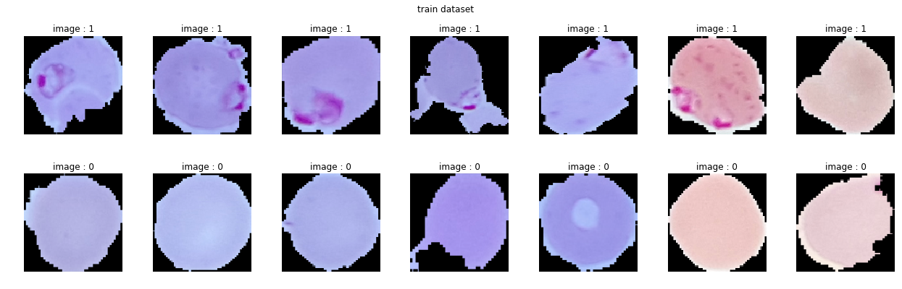
	2. Train dataset with data augmentation
	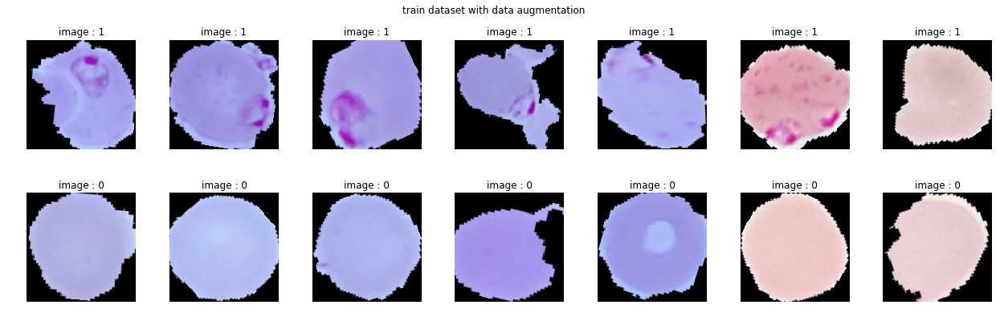
	3. Valid dataset	
	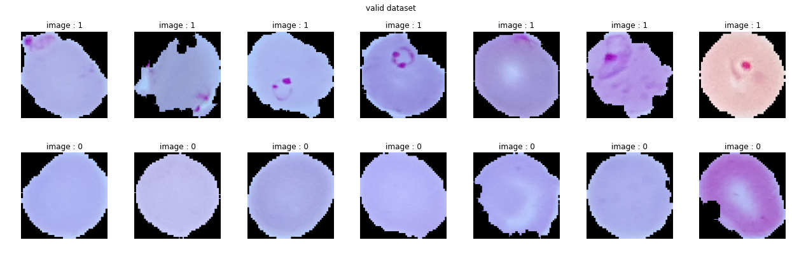
  	4. Test dataset with data augmentation 
	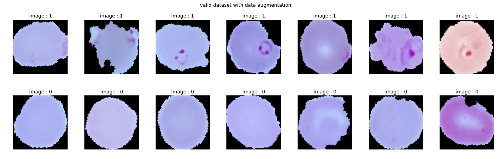

2. Create CNN model
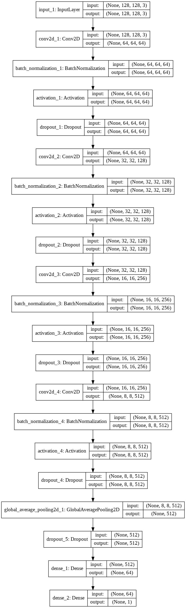	

3. Evaluation model
	1. train dataset and valid dataset (without data augmentation)
		1. the loss and accuracy of train dataset and valid dataset
		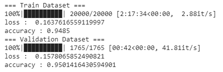	 
		2. the confusion matrix of train dataset and valid dataset
		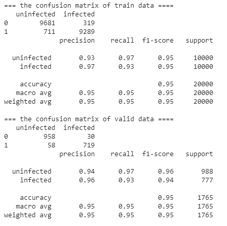	 
		3. the roc curve of train dataset and valid data
		
		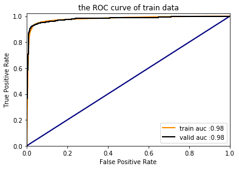
	2. test dataset (use valid dataset with data augmentation)
		1. the loss and accuracy  
		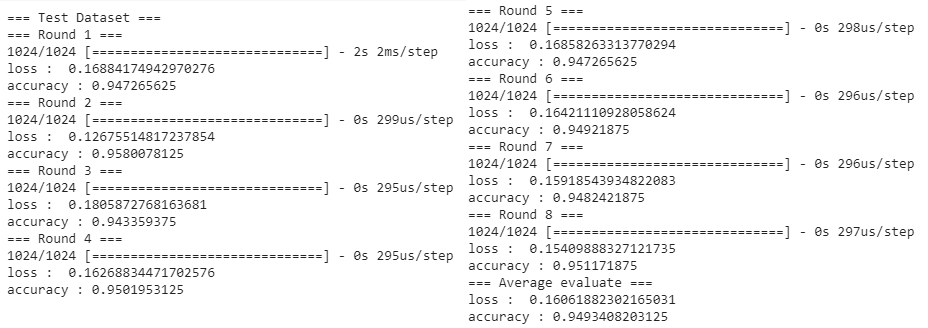 
		2. the confusion matrix 
		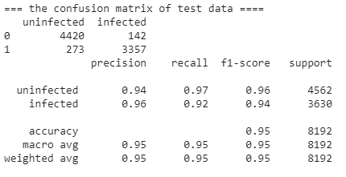	 
		3. the roc curve
		
		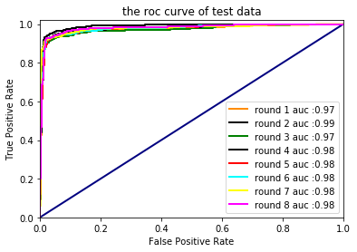	 
4. submisson result
 	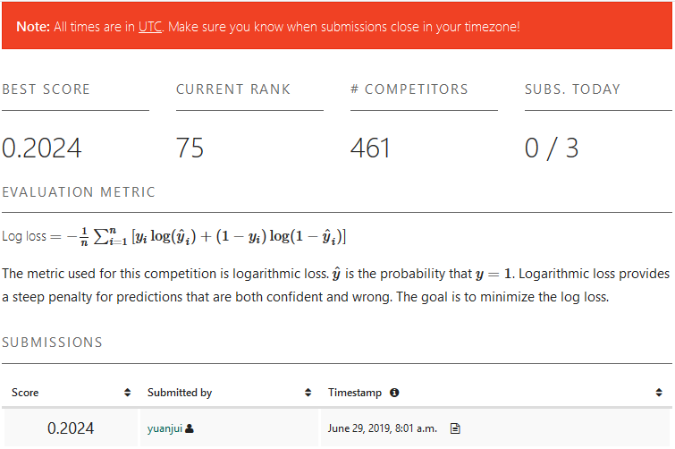
