# **KAGGLE COMPETITION: STATOIL/C-CORE ICEBERG CLASSIFIER CHALLENGE - SHIP OR ICEBERG?** #

----------
## Author ##
*Yuan Jui Huang (黃元瑞)* 

## **Data Description (the details can refer to [Kaggle](https://www.kaggle.com/c/statoil-iceberg-classifier-challenge/data "Data Description"))** ##

The Band 1 and Band 2 are signals characterized by radar backscatter produced from different polarizations at a particular incidence angle to predict whether an image contains a ship or iceberg.

## Preprocessing  ##

1. Normalization data for band 1 and band 2

2. Take the largest pixel value of band 1 and band 2 then synthesize it into band
	1. Train dataset
	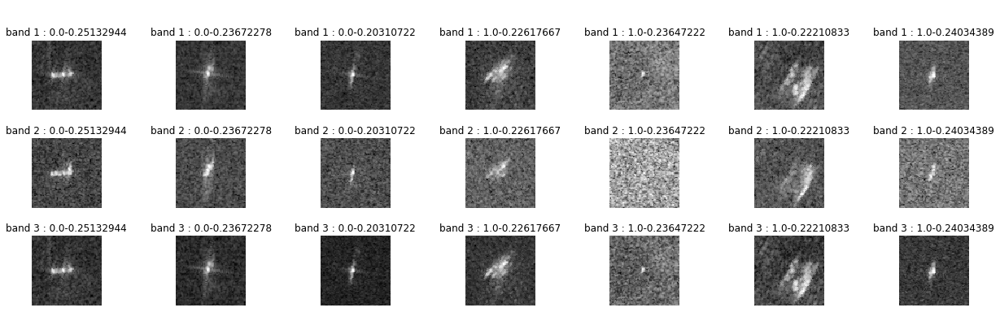
	2. Valid dataset
	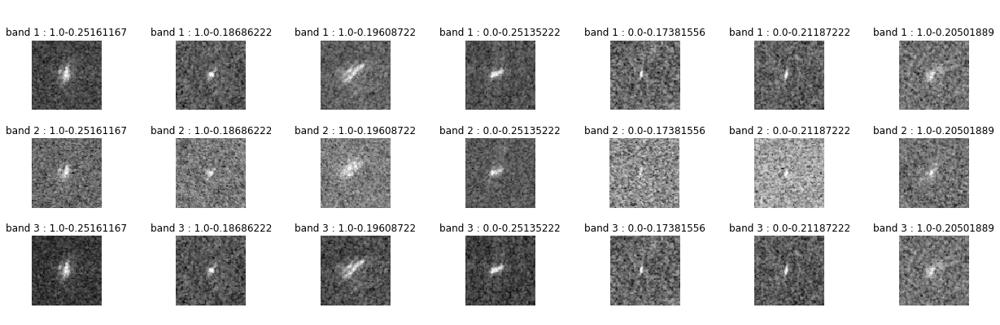

3. Use data augmentation way to add image variability 
	1. Train dataset
	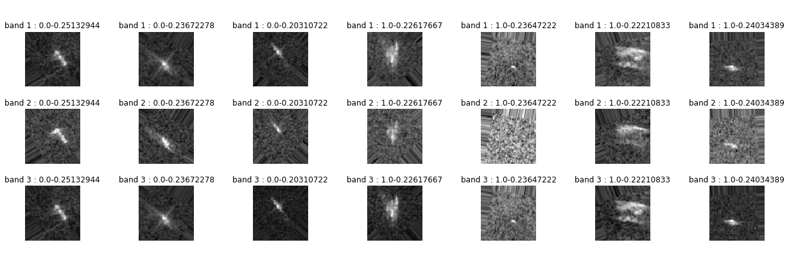
	2. Valid dataset	
	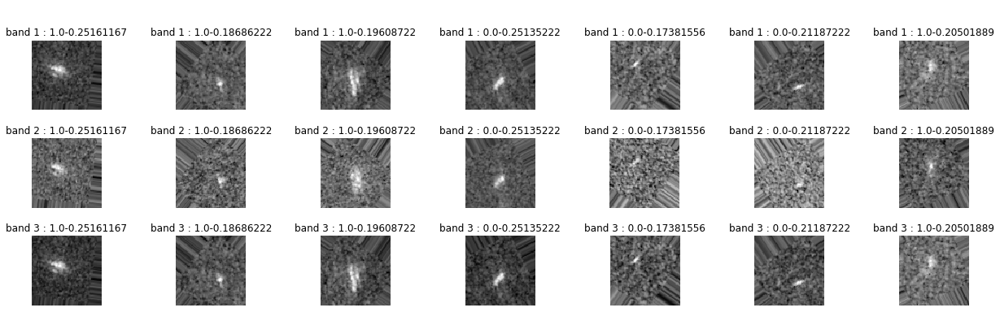

4. Create CNN model
	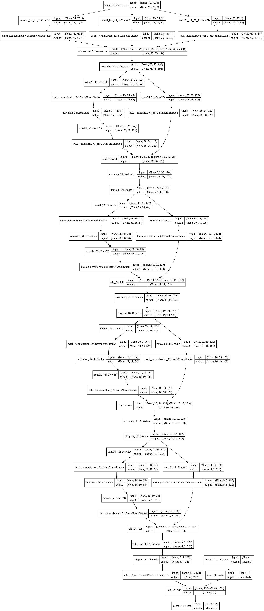

5. Evaluation model
	1. train dataset and valid dataset (without data augmentation)
		1. the loss and accuracy of train dataset and valid dataset
		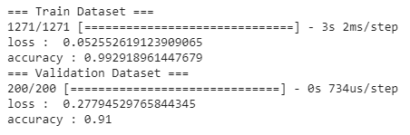	 
		2. the confusion matrix of train dataset and valid dataset
		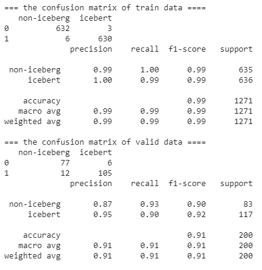	 
		3. the roc curve of train dataset and valid data
		
		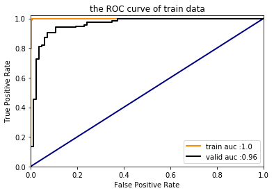
	2. test dataset (use valid dataset with data augmentation)
		1. the loss and accuracy of train dataset and valid dataset
		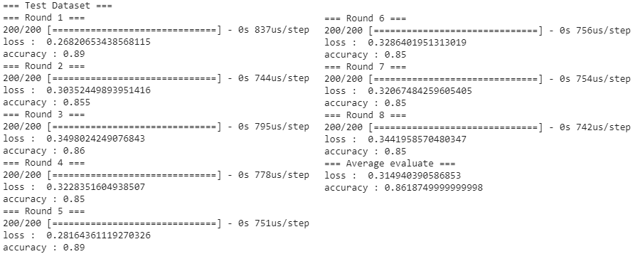 
		2. the confusion matrix of train dataset and valid dataset
		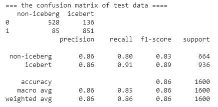	 
		3. the roc curve of train dataset and valid data
		
		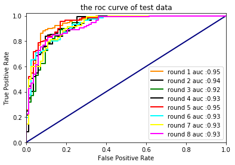	
6. submisson result
 	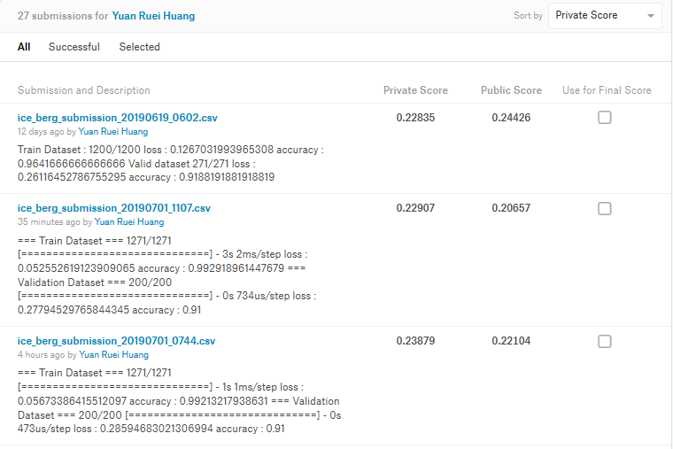
